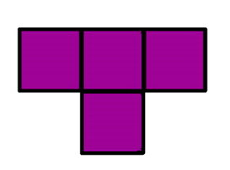

# Тетрамино

[<kbd>coderun</kbd>](https://coderun.yandex.ru/problem/tetramino)

На шахматном поле $8×8$ некоторые клетки пустые, а некоторые заняты фигурами.

Определите количество способов разместить тетрамино на этом поле, чтобы фигура занимала целиком четыре свободные клетки.

В задаче мы рассматриваем тетрамино только одного типа.



<details>
<summary>Форматы ввода/вывода и примеры</summary>

## Формат ввода

Входные данные состоят из 8 строк по 8 символов. Пустая клетка задается точкой **.**, а занятая звездочкой **\***.

## Формат вывода

Выведите количество способов разместить тетрамино на поле.

### Пример 1

<table width = "100%">
<tr>
<th>Ввод</th> <th>Вывод</th>
</tr>
<tr valign="top">
<td><pre>
<code>....****
....****
....****
....****
****....
****....
****....
****....
</code></pre></td>

<td><pre>
<code>48
</code></pre></td>
</tr>
</table>

### Пример 2

<table width = "100%">
<tr>
<th>Ввод</th> <th>Вывод</th>
</tr>
<tr valign="top">
<td><pre>
<code>********
********
********
********
********
********
********
********
</code></pre></td>

<td><pre>
<code>0
</code></pre></td>
</tr>
</table>

### Пример 3

<table width = "100%">
<tr>
<th>Ввод</th> <th>Вывод</th>
</tr>
<tr valign="top">
<td><pre>
<code>********
********
********
********
********
********
******..
........
</code></pre></td>

<td><pre>
<code>1
</code></pre></td>
</tr>
</table>

</details>

<details>
<summary>Решение <kbd>javascript</kbd></summary>

### 1. Установка зависимостей

```bash
npm install             # Установка зависимостей
```

### 2. Запуск тестирования решения в среде Jest[^1]

```bash
npm run test            # Unit-тестирование
```

</details>

#### Ссылки на документацию

[^1]: [Jest](https://jestjs.io/docs/getting-started)
